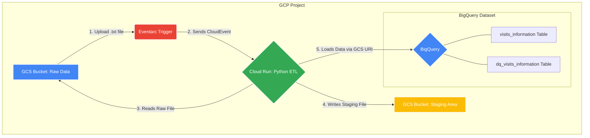

# Field Service Management (FSM) Cloud Data Pipeline

This project implements a **cloud-native data pipeline** on GCP for a Field Service Management (FSM) system. The primary goal is to ingest, validate, and structure telecommunications network data for further analysis.

---

## Architecture

The architecture is event-driven and serverless, ensuring scalability and cost-efficiency.
When a new file is uploaded to a GCS bucket, an event is triggered, which invokes a Cloud Run service to process and load the data into BigQuery.



---

## CI/CD

This project is configured with GitHub Actions to automate the deployment of both the application and its underlying infrastructure.

The CI/CD pipeline is triggered when a commit is merged into the `main` branch and a new version **tag** is created (e.g., `v1.0.1`).

-   **Application Deployment**:
    1.  A new Docker image is built and tagged with the version number.
    2.  The image is pushed to **Google Artifact Registry**.
    3.  The **Cloud Run** service is automatically updated to deploy a new revision using the latest image tag. The service then continues listening for new file upload events in the GCS bucket.

-   **Infrastructure Deployment**:
    1.  The Terraform workflow runs `terraform apply`.
    2.  Any changes to the infrastructure (e.g., modifying a BigQuery schema or changing Cloud Run settings) are applied automatically, ensuring the deployed environment always matches the configuration in the `main` branch.

---

## Local Development

### Setup

-   **Set up the Python environment:**
    ```bash
    #using uv -> pip install uv
    uv venv
    source .venv/bin/activate
    uv uv pip install -e .
    ```
-   **Authenticate with GCP:**
    ```bash
    gcloud auth application-default login
    ```
-   **Create a `.env` file:**
    ```dotenv
    BUCKET_NAME="your-gcs-bucket-name"
    FILE_NAME="<file_name"
    STAGING_PREFIX="staging_prefix"
    VALID_TABLE_ID="your-gcp-project-id.your_dataset.table_name"
    INVALID_TABLE_ID="your-gcp-project-id.your_dataset.table_name"
    PARTITION_FIELD="partition_field"
    ```

### Running the Pipeline Locally

-  **Navigate to the Terraform directory:**
    ```bash
    cd terraform
    ```

-  **Initialize Terraform:**
    ```bash
    terraform init
    ```

-  **Select workspace(project) for the deployment:**
    ```bash
    terraform workspace select <prod-env>
    ```

-  **Plan changes**
    ```bash
    terraform plan
    ```

-  **Apply the changes:**
    ```bash
    terraform apply
    ```
 
-  **Upload file in the bucket and execute the `scripts.run_local_pipeline.py` to run the ingestion process.**
    ```bash
    uv run python -m src.scripts.run_local_pipeline
    ```
---


